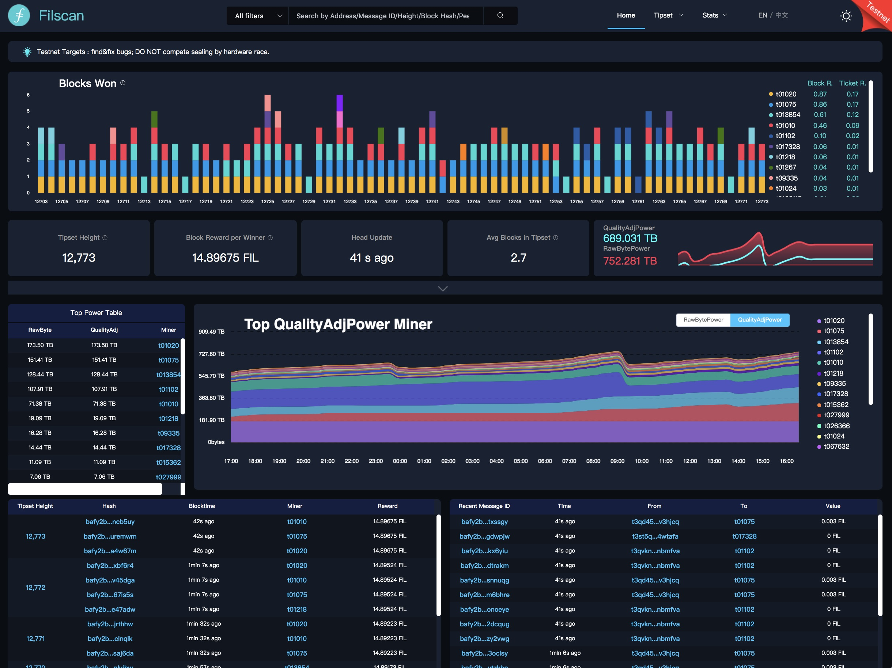

# filscan-block-explorer
Filscan.io block and message explorer

A blockchain browser for Filecoin, which can be used to view Filecoin blockchain data, including querying addresses, messages information, block heights, miner information, token information, etc.

This project was build with a wave 1 [Filecoin dev grant](https://github.com/filecoin-project/devgrants#filecoin-devgrants).

## Filscan Frontend

- The Frontend repo is available at https://github.com/ipfs-force-community/filscan-frontend
- Built with: VueJS

## Filscan Backend

- The Backend repo is available at https://github.com/ipfs-force-community/filscan-backend
- Built with: MongoDB + GoLang

## API Document
Check document [here](https://github.com/ipfs-force-community/filscan-backend/blob/master/Filscan_Interface_v1.0.md)

## License
All linked repos for this project are dual-licensed under

[MIT](https://github.com/filecoin-project/lotus/blob/master/LICENSE-MIT)

[Apache 2.0](https://github.com/filecoin-project/lotus/blob/master/LICENSE-APACHE)
